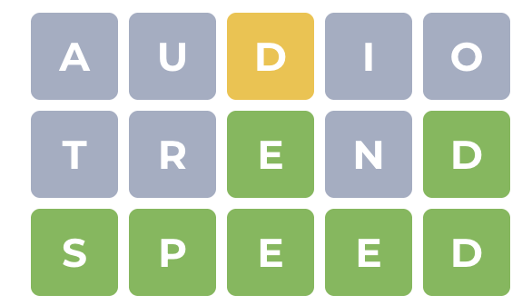

# Wordle Solver

In wordle, your task is to guess the hidden word in 6 tries. After you enter a word, you get a feedback via coloured tiles:
- grey - letter not in word
- yellow - correct letter in wrong spot
- green - correct letter and spot





## How to play
Run the `main.py` file. Program will prompt user for guess and feedback.

Feedback is code for 5-letter string where 1 represent *yellow* letter, 2 represent *green* letter and *grey* can be represented by any other character. 
```
Guess: audio
Feedback: ,,1,,

 ...
Guess: trend
Feedback: __2_2
 
 ...
Guess: speed
Feedback: 2222

Solved! Good game.
```

After each guees & feedback pair, player is presented with narrowed list of words that are possible solutions.